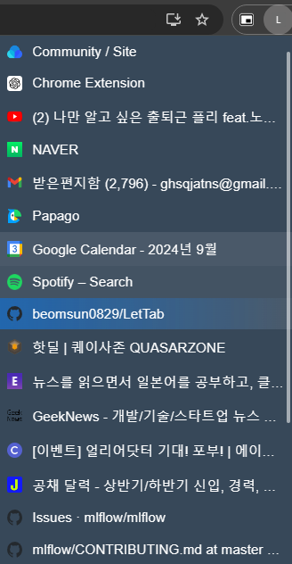
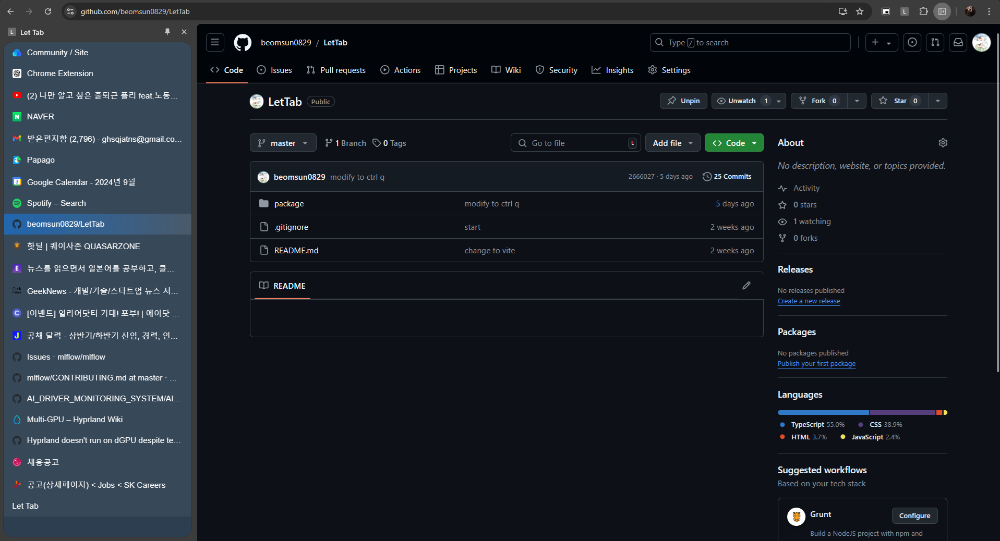

# Let Tab

OpenSource Chrome Extension Tab Manager


## Installation

clone this repo

```
cd package
npm install
npm run build
```

Go to chrome://extensions
Click "Load unpacked"
select "dist" directory

## Screenshots & Features

New tab


Pinned Icon



Side pannel



## Contributing

Pull requests are welcome. For major changes, please open an issue first
to discuss what you would like to change.

-Please make sure to update tests as appropriate.-

## License

[MIT](https://choosealicense.com/licenses/mit/)